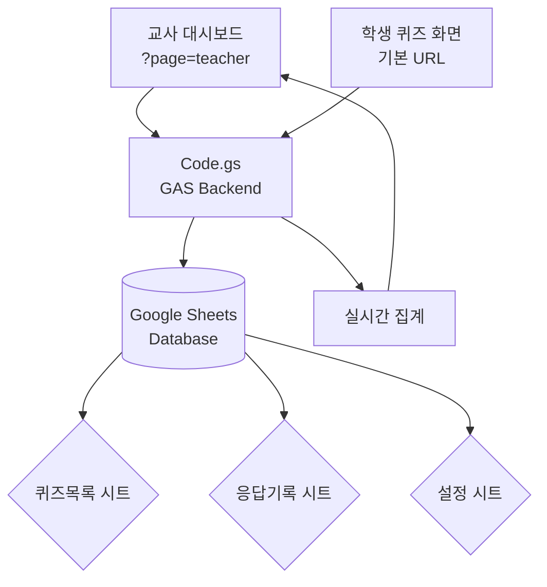

# 🎯 Realtime Quiz GScript

### *교실을 실시간 게임쇼로 — Google Sheets가 DB가 된다*

**설치 없이, 앱 없이. Google Apps Script 하나로 구축하는 교사-학생 실시간 퀴즈 & 투표 플랫폼**

[](https://github.com/Reasonofmoon/realtime-quiz-gscript)
[](https://script.google.com)
[](https://sheets.google.com)
[](LICENSE)
[](https://github.com/google/clasp)

> **"왜 별도 서버가 필요한가?"**  
> Google Sheets를 DB로, GAS를 서버로 — 월 비용 $0, 배포 1분, 동시접속 무제한.

[📖 워크샵 매뉴얼](WORKSHOP_MANUAL.md) · [🐛 이슈](../../issues)

---

## 🧠 Philosophy — "왜 만들었는가"

교육 현장의 실시간 퀴즈 도구들은 대부분 유료 구독, 앱 설치, 계정 생성을 요구합니다.

| 기준 | Kahoot / Slido | Realtime Quiz GScript |
|------|---------------|----------------------|
| 비용 | 월 $8~50 | **$0 영구 무료** |
| 설치 | 학생 앱 설치 필요 | **URL 하나로 접속** |
| 데이터 소유권 | 외부 서버 저장 | **본인 Google Sheets** |
| 커스터마이징 | 제한적 | **코드 직접 수정** |
| 오프라인 | 불가 | **GAS 캐시로 부분 가능** |



---

## ⚙️ 시스템 레이어

### Layer 1 · 라우팅 & 백엔드 (Code.gs)
- `doGet(e)` — URL 파라미터 기반 교사/학생 뷰 분기
- CRUD API — 퀴즈 생성, 수정, 삭제, 응답 집계

### Layer 2 · 데이터 레이어 (Google Sheets)
- **퀴즈목록** 시트: 문제, 선택지, 정답, 활성화 상태
- **응답기록** 시트: 학생명, 선택, 정답여부, 타임스탬프
- 최초 실행 시 3개 시트 **자동 생성**

### Layer 3 · UI (HTML Service)
- `teacher.html` — 교사 대시보드 (퀴즈 CRUD + 실시간 결과)
- `student.html` — 학생 화면 (퀴즈 참여 + 즉시 피드백)
- `style.html` — 공유 CSS (반응형, 모바일 최적화)

> **Wow Moment**: clasp push 후 **30초** 안에 학생 접속 URL 생성 완료

---

## 🚀 빠른 배포

### clasp CLI (권장)
```bash
# 1. clasp 설치 & 로그인
npm i -g @google/clasp
clasp login

# 2. 새 프로젝트 생성 & 업로드
clasp create --type webapp --title "실시간 퀴즈"
clasp push

# 3. 웹앱 배포
clasp deploy -d "v1.0 최초 배포"
clasp deployments  # → URL 확인
```

### URL 구조
```
기본 URL           → 학생 퀴즈 화면
기본 URL?page=teacher → 교사 대시보드
```

---

## 🎯 수준별 활용 가이드

### 🟢 Starter — "5분 배포"
1. `clasp push` → `clasp deploy`
2. 교사 대시보드에서 첫 퀴즈 생성
3. 학생 링크 공유

### 🔵 Professional — "커스텀 퀴즈 설계"
1. 이미지 첨부형 문제 (Google Drive URL 활용)
2. 타이머 기능 추가 (`teacher_script.html` 수정)
3. 리더보드 렌더링 커스터마이징

### 🟣 Enterprise — "학교 단위 표준화"
1. Google Workspace 도메인 접근 제한 설정
2. Google Classroom API 연동으로 과제 연계
3. 주간 자동 이메일 리포트 (Apps Script Trigger)

---

## ✨ 주요 기능

| 기능 | 설명 |
|------|------|
| 🔀 퀴즈 / 투표 | 정답 있는 퀴즈 & 의견 수렴용 투표 2가지 모드 |
| 📊 실시간 집계 | 선택지별 분포 바 차트 + 정답률 |
| 🔒 중복 방지 | 동일 학생 중복 응답 차단 |
| 📱 반응형 | 모바일 / 태블릿 / PC 완전 지원 |
| ⚡ 활성화 제어 | 퀴즈 공개 / 숨김 on/off |

---

## 🔧 커스터마이징

| 우선순위 | 방법 | 난이도 | 효과 |
|----------|------|--------|------|
| **1st** | `appsscript.json` 접근 권한 변경 | ⭐ | 공개/조직 전용 설정 |
| **2nd** | `style.html` CSS 수정 | ⭐⭐ | 학교 브랜딩 적용 |
| **3rd** | `Code.gs` API 확장 | ⭐⭐⭐ | 기능 모듈 추가 |

---

## 📋 License

MIT © [Reasonofmoon](https://github.com/Reasonofmoon)
